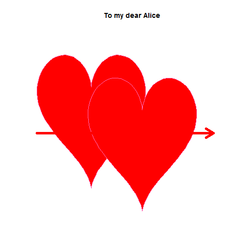

R: Plot for Fun
====================

[More about me](http://felixfan.github.io)    

### Plot Heart

#### Method 1 (x^2 + (y - ( x^2 )^( 1/3 ) )^2 = 1)   


```r
x = seq(10^(-10) - 1, 1 - 10^(-10), length.out = 100)
y1 = (x^2)^(1/3) + sqrt(1 - x^2)
y2 = (x^2)^(1/3) - sqrt(1 - x^2)
plot(x, y1, ylim = c(-1.5, 1.5), xlim = c(-1, 1), type = "l", xaxt = "n", 
	yaxt = "n", xlab = "", ylab = "", frame.plot = FALSE)
points(x, y2, type = "l")
polygon(x, y1, col = "red", border = "red")
polygon(x, y2, col = "red", border = "red")
```

 


#### Method 2 (x^2 + (5y/4-sqrt(abs(x)))^2 = 1)


```r
x = seq(10^(-10) - 1, 1 - 10^(-10), length.out = 500)
y1 = 4/5 * (sqrt(1 - x^2) + sqrt(abs(x)))
y2 = 4/5 * (-sqrt(1 - x^2) + sqrt(abs(x)))
plot(x, y1, ylim = c(-1.5, 1.5), xlim = c(-1, 1), type = "l", xaxt = "n", 
	yaxt = "n", xlab = "", ylab = "", frame.plot = FALSE)
points(x, y2, type = "l")
polygon(x, y1, col = "red", border = "red")
polygon(x, y2, col = "red", border = "red")
```

 


#### Method 3


```r
t = seq(0, 2 * pi, length.out = 100)
x = 16 * sin(t)^3
y = 13 * cos(t) - 5 * cos(2 * t) - 2 * cos(3 * t) - cos(4 * t)
plot(x, y, type = "l", xaxt = "n", yaxt = "n", xlab = "", ylab = "", 
	frame.plot = FALSE)
polygon(x, y, col = "red", border = "red")
```

 


#### Method 4


```r
plot(1, 1, pch = 169, font = 5, cex = 20, col = "red", xaxt = "n", 
	yaxt = "n", xlab = "", ylab = "", frame.plot = FALSE)
```

 


### plot heart for fun


```r
t = seq(0, 2 * pi, length.out = 100)
x = 16 * sin(t)^3
y = 13 * cos(t) - 5 * cos(2 * t) - 2 * cos(3 * t) - cos(4 * t)
plot(x, y, type = "l", xaxt = "n", yaxt = "n", xlab = "", 
	ylab = "", frame.plot = FALSE)
polygon(x, y, col = "red", border = "red")
xp = c(-14, -13, -10, -5, 5, 7, 11, 14, -16, 15)
yp = c(-10, -5, -8, -13, -15, -13, -9, -7, 11, 12)
points(xp, yp, pch = 169, font = 5, col = "red", xaxt = "n", 
	yaxt = "n", xlab = "", ylab = "")
```

 


```r
t = seq(0, 2 * pi, length.out = 100)
x1 = 16 * sin(t)^3
y1 = 13 * cos(t) - 5 * cos(2 * t) - 2 * cos(3 * t) - cos(4 * t)

x2 = x1 + 15
y2 = y1 - 5

plot(x1, y1, type = "l", xaxt = "n", yaxt = "n", xlab = "", 
	ylab = "", frame.plot = FALSE, xlim = c(-16, 40), 
	ylim = c(-21, 16), main = "To my dear Alice")
polygon(x1, y1, col = "red", border = "hotpink")

polygon(x2, y2, col = "red", border = "hotpink")
arrows(x0 = -16, y0 = -5, x1 = 36, y1 = -5, col = "red", lwd = 5)
```

 


### Plot Thong


```r
thong <- function(h = 9) {
    # set up plot
    xrange = c(-15, 15)
    yrange = c(0, 16)
    plot(0, xlim = xrange, ylim = yrange, type = "n", xaxt = "n", 
	yaxt = "n", xlab = "", ylab = "", frame.plot = FALSE)
    
    # draw outer envelope
    yr = seq(yrange[1], yrange[2], len = 50)
    offsetFn = function(y) {
        2 * sin(0 + y/3)
    }
    offset = offsetFn(yr)
    leftE = function(y) {
        -10 - offsetFn(y)
    }
    rightE = function(y) {
        10 + offsetFn(y)
    }
    
    xp = c(leftE(yr), rev(rightE(yr)))
    yp = c(yr, rev(yr))
    polygon(xp, yp, col = "#ffeecc", border = NA)
    
    # feasible region upper limit: 
	# left and right defined by triple-log
    # function:
    xt = seq(0, rightE(h), len = 100)
    yt = log(1 + log(1 + log(xt + 1)))
    yt = yt - min(yt)
    yt = h * yt/max(yt)
    x = c(leftE(h), rightE(h), rev(xt), -xt)
    y = c(h, h, rev(yt), yt)
    polygon(x, y, col = "red", border = NA)
}

thong(h = 9)
```

 


[**reference**](http://stackoverflow.com/questions/8082429/plot-a-heart-in-r)        

    


