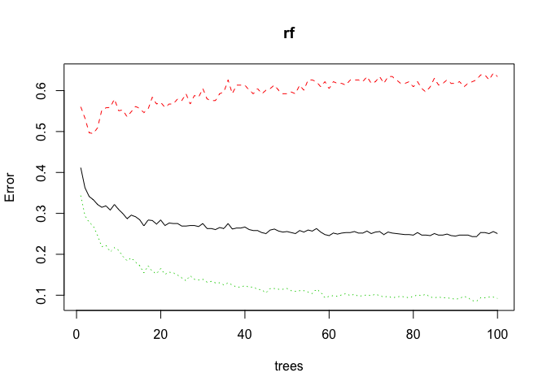
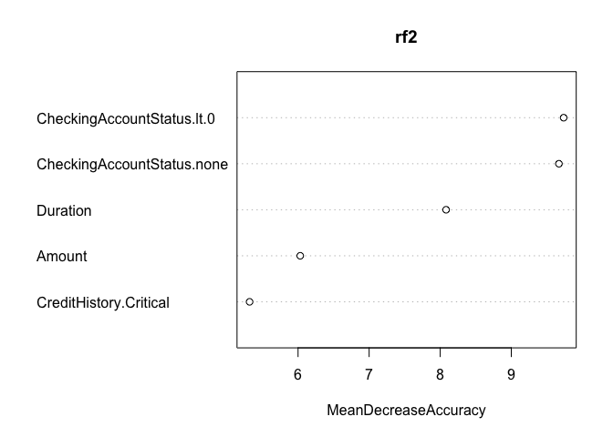
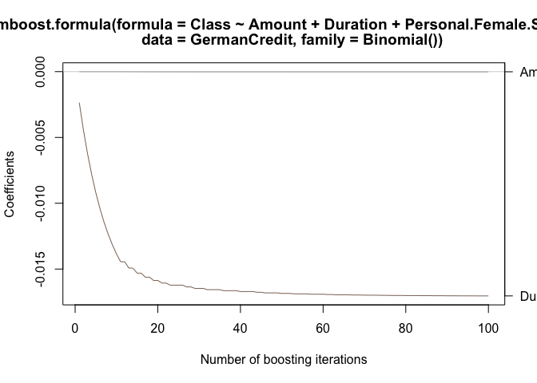
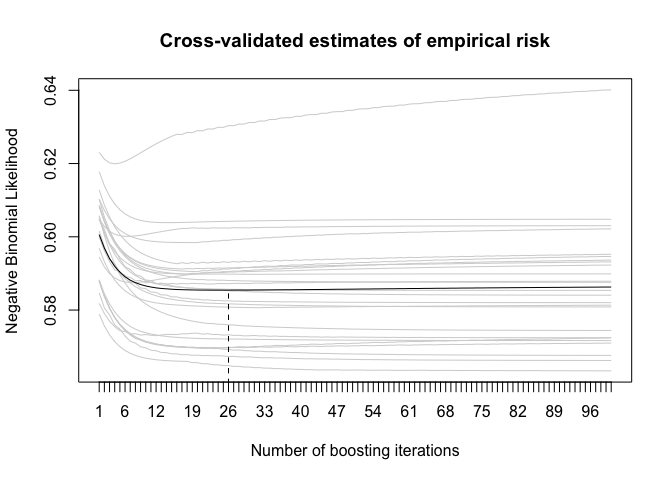
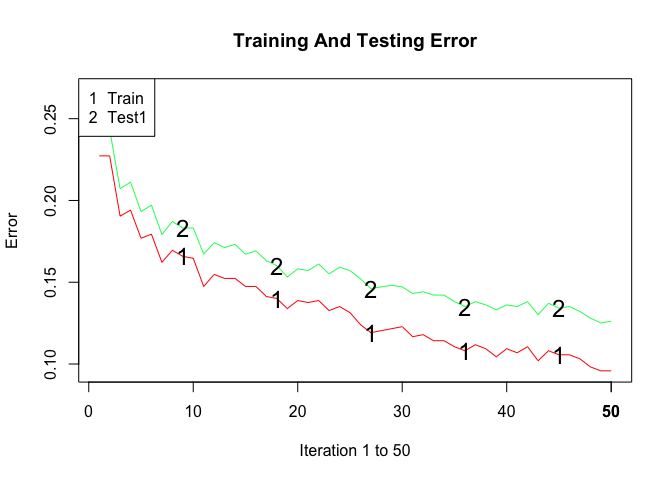
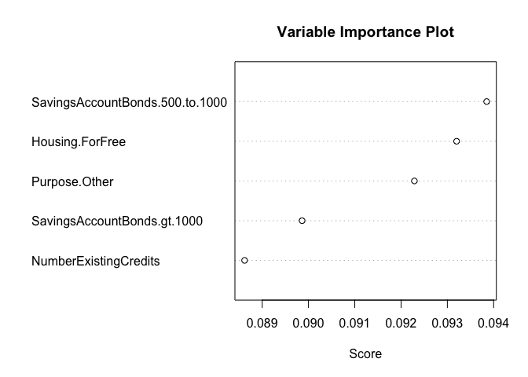

# Ensemble Learning


# 1. Decision Trees in R

## 1.1 Loading required libraries rpart, party and partykit


```r
library(rpart)
library(party)
library(partykit)

set.seed(-999)
```

## 1.2 Accessing credit scores


```r
library(caret)
data(GermanCredit)
head(GermanCredit[,1:5])
```

```
  Duration Amount InstallmentRatePercentage ResidenceDuration Age
1        6   1169                         4                 4  67
2       48   5951                         2                 2  22
3       12   2096                         2                 3  49
4       42   7882                         2                 4  45
5       24   4870                         3                 4  53
6       36   9055                         2                 4  35
```

## 1.3 Split data into index subset for training (80 %) and testing (20 %) instances


```r
inTrain <- runif(nrow(GermanCredit)) < 0.8
training <- GermanCredit[inTrain,]
testing <- GermanCredit[-inTrain,]
```

## 1.4 Building a decision tree with rpart


```r
dt <- rpart(Class ~ Duration + Amount + Age, method="class", data=training)
```

## 1.5 Plot decision tree using plot(dt) and text(dt)


```r
plot(dt)
text(dt)
```

<!-- -->

## 1.6 Drawing Decision Trees Nicely


```r
plot(as.party(dt))
```

<!-- -->

## 1.7 Complexity Parameter


```r
printcp(dt)
```

```

Classification tree:
rpart(formula = Class ~ Duration + Amount + Age, data = training, 
    method = "class")

Variables actually used in tree construction:
[1] Age      Amount   Duration

Root node error: 238/814 = 0.29238

n= 814 

        CP nsplit rel error  xerror     xstd
1 0.046218      0   1.00000 1.00000 0.054527
2 0.025210      1   0.95378 1.00000 0.054527
3 0.018908      2   0.92857 0.97479 0.054115
4 0.012605      4   0.89076 0.97479 0.054115
5 0.010000      6   0.86555 0.97059 0.054044
```

- Rows show results for trees with different numbers of nodes    
- Cross-validation error in column xerror    
- Complexity parameter in column CP, similar to number of nodes    

## 1.8 Pruning Decision Trees

- Reduce tree size by removing nodes with little predictive power     
- Aim: Minimize cross-validation error in column xerror    


```r
m <- which.min(dt$cptable[, "xerror"])
```

- Optimal number of splits    


```r
dt$cptable[m, "nsplit"]
```

```
[1] 6
```

- Choose corresponding complexity parameter    


```r
dt$cptable[m, "CP"]
```

```
[1] 0.01
```


```r
p <- prune(dt, cp = dt$cptable[which.min(dt$cptable[, "xerror"]), "CP"])
plot(as.party(p))
```

<!-- -->

## 1.9 Prediction with Decision Trees


```r
pred <- predict(p, testing, type="class")
pred[1:5]
```

```
   2    3    4    5    6 
 Bad Good Good Good Good 
Levels: Bad Good
```

## 1.10 Confusion matrix

- horizontal: true class;    
- vertical: predicted class    


```r
table(pred=pred, true=testing$Class)
```

```
      true
pred   Bad Good
  Bad   56   19
  Good 244  680
```

# 2. Concepts of Ensemble Learning

- Combine predictions of multiple learning algorithms → ensemble    
- Often leads to a better predictive performance than a single learner    
- Well-suited when small differences in the training data produce very different classifiers (e. g. decision trees)    
- Drawbacks: increases computation time, reduces interpretability      

**Reasoning**        

- Classifiers $C_{1}$,...,$C_{K}$ which are independent, i. e. cor($C_{i}$, $C_{j}$) = 0       
- Each has an error probability of $P_{i}$ < 0.5 on the training data     
- Then an ensemble of classifiers should have an error probability lower than each individual $P_{i}$   

**Example**   

- Given K classifiers, each with the same error probability $P_{ε}$ = 0.3
- Probability that exactly L classifiers make an error is    
$$\binom{K}{L}P_{ε}^L(1-P_{ε})^{K-L}$$
- Only if Pε > 0.5, the error rate of the ensemble increases    

## 2.1 Various methods exist for ensemble learning

### 2.1.1 Constructing ensembles: methods for obtaining a set of classifiers

- Bagging (also named Bootstrap Aggregation)    
- Random Forest   
- Cross-validation      

### 2.1.2 Combining classifiers: methods for combining different classifiers

- Stacking    
- Bayesian Model Averaging   
- Boosting   
- AdaBoost   

# 3. Bagging (Bootstrap Aggregation) 

**Idea**    

- Reuse the same training algorithm several times on different subsets of the training data   

   

**Algorithm**   

- Given training set D of size N    
- Bagging generates new training sets $D_{i}$ of size M by sampling with replacement from D    
- Some observations may be repeated in each $D_{i}$    
- If M = N, then on average 63.2% (Breiman, 1996) of the original training dataset D is represented, the rest are duplicates     
- Afterwards train classifier on each $D_{i}$ separately   

# 4. Random Forests

- Random Forests are an ensemble learning method for classification and regression      
- It combines multiple individual decision trees by means of bagging      
- Overcomes the problem of overfitting decision trees     

**Algorithm**   

- Create many decision trees by bagging     
- Inject randomness into decision trees    
  -- Tree grows to maximum size and is left unpruned    
  -- Each split is based on randomly selected subset of attributes    
- Ensemble trees (i. e. the random forest) vote on categories by majority   

**Advantages**   

- Simple algorithm that learns non-linearity    
- Good performance in practice      
- Fast training algorithm    
- Resistant to overfitting    

**Limitations**   

- High memory consumption during tree construction    
- Little performance gain from large training data   

## 4.1 Random Forests in R


```r
library(randomForest)
rf <- randomForest(Class ~ ., data=training, ntree=100)
```

Options to control behavior:    

- `ntree` controls the number of trees (default: 500)    
- `mtry` gives number of variables to choose from at each node    
- `na.action` specifies how to handle missing values     
- `importance=TRUE` calculates variable importance metric    


```r
plot(rf)
```

<!-- -->

- Dotted lines represent corresponding error of classes and solid black line represents overall error   


```r
rf$confusion
```

```
     Bad Good class.error
Bad   87  151  0.63445378
Good  53  523  0.09201389
```


```r
pred <- predict(rf, newdata=testing)
table(pred=pred, true=testing$Class)
```

```
      true
pred   Bad Good
  Bad  260   12
  Good  40  687
```

## 4.2 Variable Importance in R


```r
rf2 <- randomForest(Class ~ ., 
                    data=GermanCredit, #with full dataset
                    ntree=100,
                    importance=TRUE)
```


```r
varImpPlot(rf2, type=1, n.var=5)
```

<!-- -->

- `type` choose the importance metric (= 1 is the mean decrease in accuracy if the variable would be randomly permuted)    
- `n.var` denotes number of variables    

# 5. Boosting

- Combine multiple classifiers to improve classification accuracy    
- Works together with many different types of classifiers    
- None of the classifier needs extremely good, only better than chance    
- Idea: train classifiers on a subset of the training data that is most informative given the current classifiers   
- Yields sequential classifier selection    

## 5.1 Boosting in R


```r
library(mboost)
```

### 5.1.1 Fit a generalized linear model via glmboost(...)   


```r
m.boost <- glmboost(Class ~ Amount + Duration + Personal.Female.Single,
                    family=Binomial(), # needed for classification
                    data=GermanCredit)
```


```r
coef(m.boost)
```

```
  (Intercept)        Amount      Duration 
 4.104949e-01 -1.144369e-05 -1.703911e-02 
attr(,"offset")
[1] 0.4236489
```


```r
plot(m.boost, ylim=range(coef(m.boost, which=c("Amount", "Duration"))))
```

<!-- -->


```r
cv.boost <- cvrisk(m.boost)
mstop(cv.boost)               # optimal no. of iterations to prevent overfitting
```

```
[1] 26
```


```r
plot(cv.boost, main="Cross-validated estimates of empirical risk")
```

<!-- -->

### 5.1.2 fit generalized additive model via component-wise boosting


```r
m.boost <- gamboost(Class ~ Amount + Duration,
                    family=Binomial(), # needed for classification
                    data=GermanCredit)
m.boost
```

```

	 Model-based Boosting

Call:
gamboost(formula = Class ~ Amount + Duration, data = GermanCredit,     family = Binomial())


	 Negative Binomial Likelihood 

Loss function: { 
     f <- pmin(abs(f), 36) * sign(f) 
     p <- exp(f)/(exp(f) + exp(-f)) 
     y <- (y + 1)/2 
     -y * log(p) - (1 - y) * log(1 - p) 
 } 
 

Number of boosting iterations: mstop = 100 
Step size:  0.1 
Offset:  0.4236489 
Number of baselearners:  2 
```

# 6. AdaBoost

- Instead of resampling, reweight misclassified training examples   

**Benefits**   

- Simple combination of multiple classifiers    
- Easy implementation    
- Different types of classifiers can be used     
- Commonly in used across many domains   

**Limitations**   

- Sensitive to misclassified points in training data   

## 6.1 AdaBoost in R


```r
library(ada)
```


```r
m.ada <- ada(Class ~ ., data=training, iter=50)
```


```r
m.ada.test <- addtest(m.ada, test.x=testing, test.y=testing$Class)
```


```r
m.ada.test
```

```
Call:
ada(Class ~ ., data = training, iter = 50)

Loss: exponential Method: discrete   Iteration: 50 

Final Confusion Matrix for Data:
          Final Prediction
True value Bad Good
      Bad  169   69
      Good   9  567

Train Error: 0.096 

Out-Of-Bag Error:  0.123  iteration= 48 

Additional Estimates of number of iterations:

train.err1 train.kap1 test.errs2 test.kaps2 
        49         49         49         49 
```


```r
plot(m.ada.test, test=TRUE)
```

<!-- -->


```r
varplot(m.ada.test, max.var.show=5) # first 5 variables
```

<!-- -->
