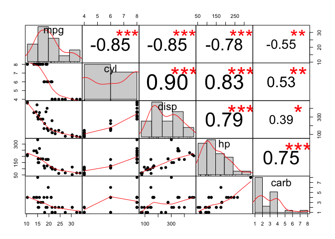
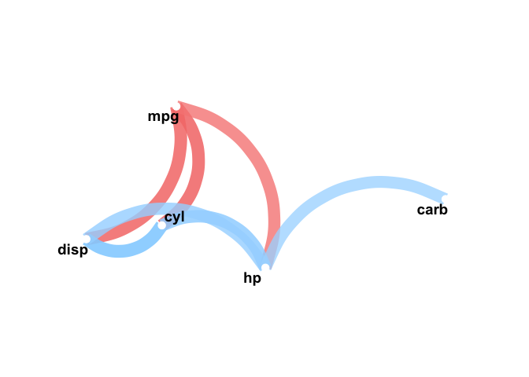
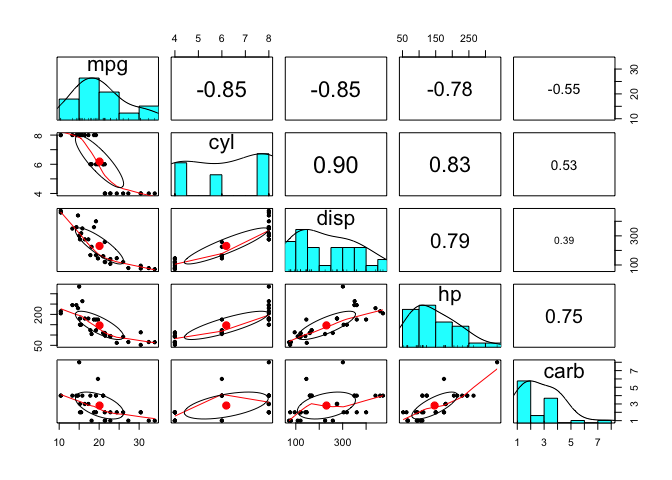
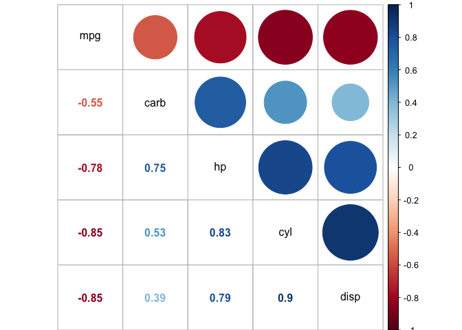
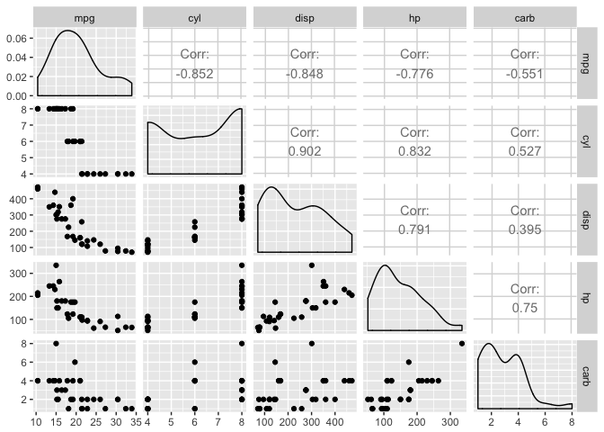
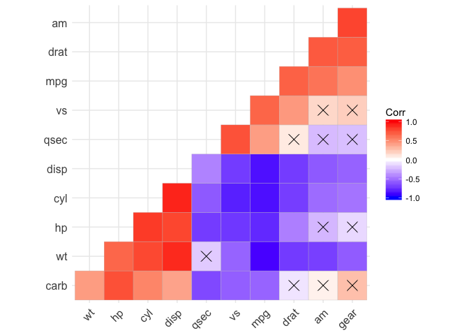

# Visualize Correlation Matrices


```r
mydata <- mtcars[, c('mpg', 'cyl', 'disp', 'hp', 'carb')]
```

# 1. PerformanceAnalytics Package


```r
library("PerformanceAnalytics")
chart.Correlation(mydata, histogram=TRUE, pch=19)
```

<!-- -->

# 2. Corrr Package


```r
library(corrr)
mydata %>% correlate() %>% network_plot(min_cor=0.6)
```

<!-- -->

# 3. Psych Package


```r
library(psych)
pairs.panels(mydata, scale=TRUE)
```

<!-- -->

# 4. Corrplot Package


```r
library(corrplot)
corrplot.mixed(cor(mydata), order="hclust", tl.col="black")
```

<!-- -->

# 5. GGally Package


```r
library(GGally)
ggpairs(mydata)
```

<!-- -->

# 6. ggcorrplot Package


```r
library(ggcorrplot)
ggcorrplot(cor(mtcars), p.mat = cor_pmat(mtcars), hc.order=TRUE, type='lower')
```

<!-- -->

# Reference

- https://github.com/JamesMarquezDev/Jupyter-Notebooks-Statistic-Walk-Throughs-Using-R/blob/master/correlation_matrices_in_r.ipynb


