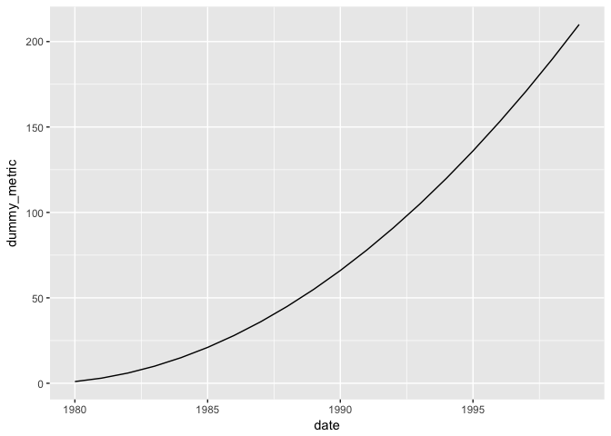

# data-science-crash-course


# ggplot2

## Bar Chart Code


```r
library(ggplot2)
ggplot(data = diamonds, aes(x = cut)) + geom_bar()
```

<!-- -->

## Scatter Plot Code


```r
ggplot(data = diamonds, aes(x = carat, y = price)) + geom_point()
```

<!-- -->

## Line Chart Code


```r
df.dummy_data <- data.frame(
  dummy_metric = cumsum(1:20),
  date = seq.Date(as.Date("1980-01-01"), by="1 year", length.out=20)
)

ggplot(data = df.dummy_data, aes(x = date, y = dummy_metric)) + geom_line()
```

<!-- -->

# dplyr

## filter

filter() performs row selection from your data.


```r
library(dplyr)
df.diamonds_ideal <- filter(diamonds, cut=="Ideal")
head(df.diamonds_ideal)
```

```
# A tibble: 6 × 10
  carat   cut color clarity depth table price     x     y     z
  <dbl> <ord> <ord>   <ord> <dbl> <dbl> <int> <dbl> <dbl> <dbl>
1  0.23 Ideal     E     SI2  61.5    55   326  3.95  3.98  2.43
2  0.23 Ideal     J     VS1  62.8    56   340  3.93  3.90  2.46
3  0.31 Ideal     J     SI2  62.2    54   344  4.35  4.37  2.71
4  0.30 Ideal     I     SI2  62.0    54   348  4.31  4.34  2.68
5  0.33 Ideal     I     SI2  61.8    55   403  4.49  4.51  2.78
6  0.33 Ideal     I     SI2  61.2    56   403  4.49  4.50  2.75
```

## select()

select() allows you to select specific columns from your data.


```r
df.diamonds_ideal <- select(df.diamonds_ideal, carat, cut, color, price, clarity)
head(df.diamonds_ideal)
```

```
# A tibble: 6 × 5
  carat   cut color price clarity
  <dbl> <ord> <ord> <int>   <ord>
1  0.23 Ideal     E   326     SI2
2  0.23 Ideal     J   340     VS1
3  0.31 Ideal     J   344     SI2
4  0.30 Ideal     I   348     SI2
5  0.33 Ideal     I   403     SI2
6  0.33 Ideal     I   403     SI2
```

## mutate()

mutate() allows you to add variables to your dataset.


```r
df.diamonds_ideal <- mutate(df.diamonds_ideal, price_per_carat = price/carat)
head(df.diamonds_ideal)
```

```
# A tibble: 6 × 6
  carat   cut color price clarity price_per_carat
  <dbl> <ord> <ord> <int>   <ord>           <dbl>
1  0.23 Ideal     E   326     SI2        1417.391
2  0.23 Ideal     J   340     VS1        1478.261
3  0.31 Ideal     J   344     SI2        1109.677
4  0.30 Ideal     I   348     SI2        1160.000
5  0.33 Ideal     I   403     SI2        1221.212
6  0.33 Ideal     I   403     SI2        1221.212
```

## arrange()

arrange() sorts your data.


```r
# create simple data frame containing disordered numeric variable
df.disordered_data <- data.frame(num_var = c(2,3,5,1,4))
head(df.disordered_data)
```

```
  num_var
1       2
2       3
3       5
4       1
5       4
```


```r
# now we'll order them with arrange()
arrange(df.disordered_data, num_var)
```

```
  num_var
1       1
2       2
3       3
4       4
5       5
```


```r
# we can also put them in descending order
arrange(df.disordered_data, desc(num_var))
```

```
  num_var
1       5
2       4
3       3
4       2
5       1
```

## summarize()

summarize() allows you to compute summary statistics.


```r
summarize(df.diamonds_ideal, avg_price = mean(price, na.rm = TRUE))
```

```
# A tibble: 1 × 1
  avg_price
      <dbl>
1  3457.542
```

# Machine learning


```r
ggplot(data = mtcars, aes(x = wt, y = mpg)) + geom_point()
```

<!-- -->


```r
library(caret)
model.mtcars_lm <- train(mpg ~ wt, data = mtcars, method = "lm")
```


```r
coef.icept <- coef(model.mtcars_lm$finalModel)[1]
coef.slope <- coef(model.mtcars_lm$finalModel)[2]
ggplot(data = mtcars, aes(x = wt, y = mpg)) + geom_point() + 
    geom_abline(slope = coef.slope, intercept = coef.icept, color = "red")
```

<!-- -->


