# ggplot2 examples


```r
library(ggplot2)
library(reshape2)
data(Oxboys, package = "nlme")
diamonds = na.omit(diamonds)
msleep = na.omit(msleep)
mtcars = na.omit(mtcars)
Oxboys = na.omit(Oxboys)
mpg = na.omit(mpg)
mydata <- mtcars[, c(1,3,4,5,6,7)]
```

# 1. 散点图


```r
ggplot(mtcars, aes(x=mpg, y=wt)) + geom_point()
```

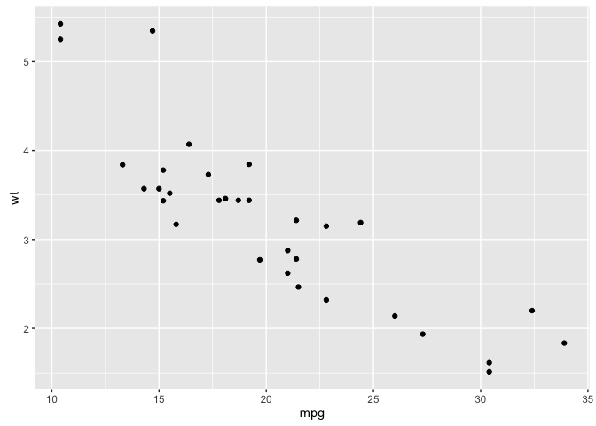<!-- -->


```r
ggplot(mtcars, aes(x=mpg, y=wt)) + geom_point(aes(colour = factor(cyl)))
```

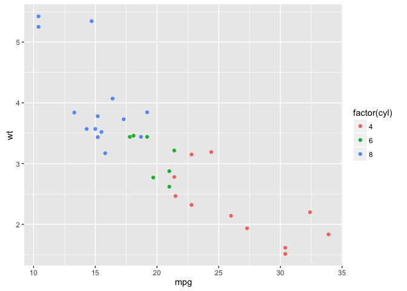<!-- -->


```r
ggplot(mtcars, aes(x=mpg, y=wt)) + geom_point(colour = "darkblue")
```

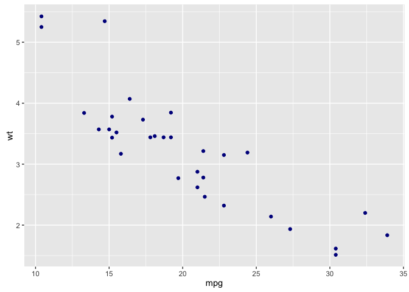<!-- -->


# 2. 柱状图


```r
ggplot(mpg, aes(class)) + geom_bar(fill="steelblue",colour="black")
```

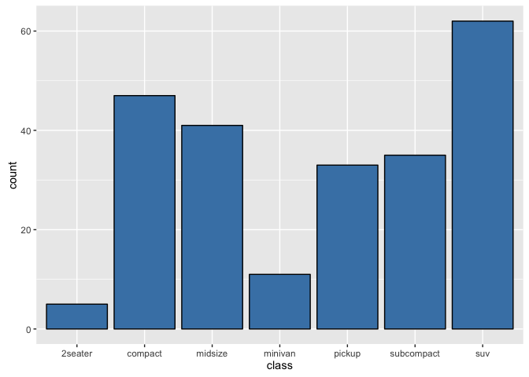<!-- -->

# 3. 直方图


```r
ggplot(diamonds, aes(carat)) + geom_histogram(bins = 30)
```

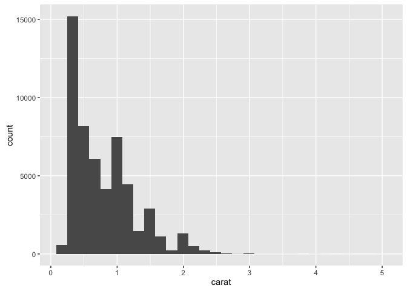<!-- -->

# 4. 热图


```r
cormat <- round(cor(mydata),2)
melted_cormat <- melt(cormat)
head(melted_cormat)
```

```
  Var1 Var2 value
1  mpg  mpg  1.00
2 disp  mpg -0.85
3   hp  mpg -0.78
4 drat  mpg  0.68
5   wt  mpg -0.87
6 qsec  mpg  0.42
```


```r
ggplot(data = melted_cormat, aes(x=Var1, y=Var2)) + geom_raster(aes(fill=value))
```

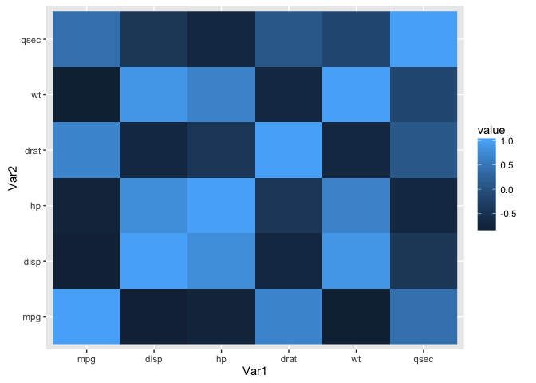<!-- -->


```r
ggplot(data = melted_cormat, aes(x=Var1, y=Var2)) + geom_raster(aes(fill=value), interpolate = TRUE)
```

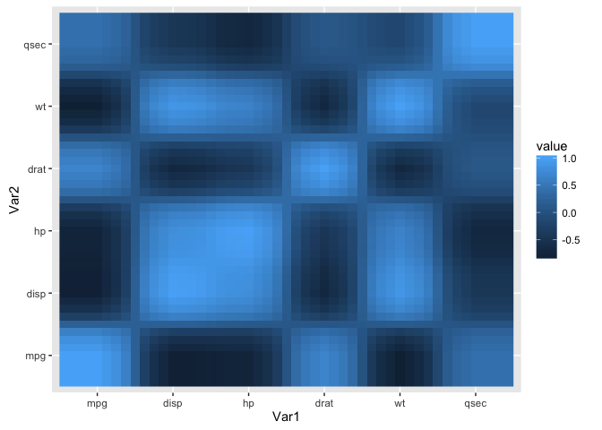<!-- -->

# 5. 箱线图


```r
ggplot(mpg, aes(x=class, y=hwy)) + geom_boxplot()
```

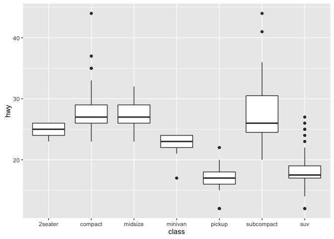<!-- -->


```r
ggplot(mpg, aes(x=class, y=hwy)) + geom_boxplot() + geom_jitter(width = 0.2)
```

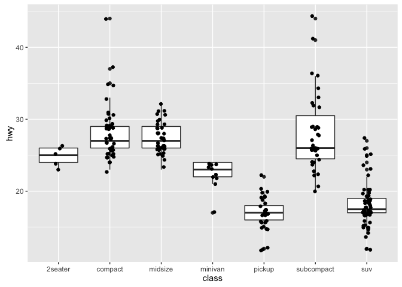<!-- -->


```r
ggplot(mpg, aes(x=class, y=hwy)) + geom_boxplot() + coord_flip()
```

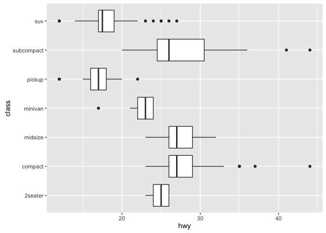<!-- -->


```r
ggplot(mpg, aes(x=class, y=hwy)) + geom_boxplot(outlier.colour = "red", outlier.shape = 1)
```

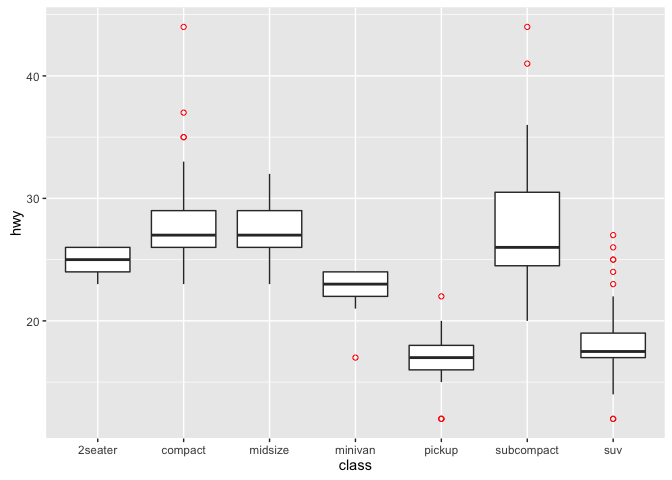<!-- -->


