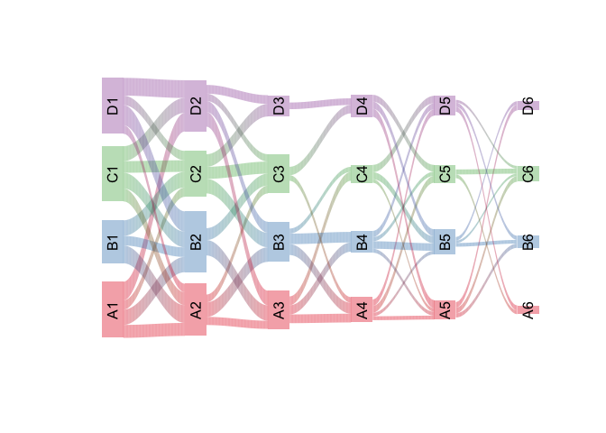
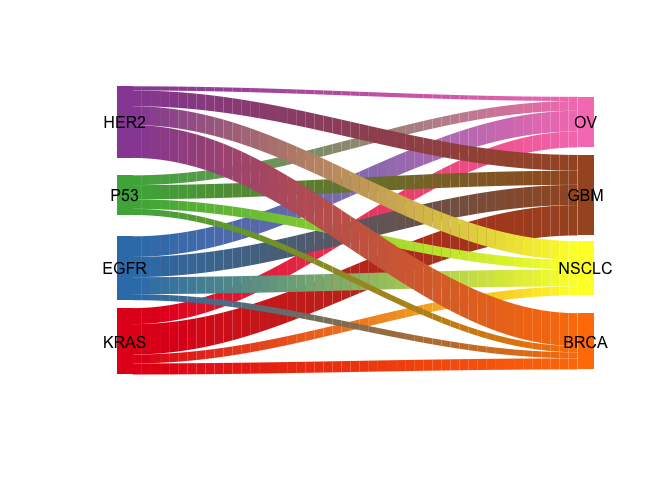

# Sankey plot 桑基图


# Example from R-blogger

Ref: https://www.r-bloggers.com/plotting-flows-with-riverplot/


```r
edges = data.frame(N1 = paste0(rep(LETTERS[1:4], each = 4),
                               rep(1:5, each = 16)),
                   N2 = paste0(rep(LETTERS[1:4], 4), rep(2:6, each = 16)),
                   Value = runif(80, min = 2, max = 5) * rep(c(1, 0.8, 0.6, 0.4, 0.3),
                                                             each = 16),
                   stringsAsFactors = F)

edges = edges[sample(c(TRUE, FALSE), nrow(edges), replace = TRUE,
                     prob = c(0.8, 0.2)),]
head(edges)
```

```
  N1 N2    Value
1 A1 A2 3.167214
2 A1 B2 3.749182
3 A1 C2 2.283997
4 A1 D2 4.557894
5 B1 A2 4.360240
6 B1 B2 2.358027
```


```r
nodes = data.frame(ID = unique(c(edges$N1, edges$N2)), stringsAsFactors = FALSE)
nodes$x = as.integer(substr(nodes$ID, 2, 2))
nodes$y = as.integer(sapply(substr(nodes$ID, 1, 1), charToRaw)) - 65
rownames(nodes) = nodes$ID
head(nodes)
```

```
   ID x y
A1 A1 1 0
B1 B1 1 1
C1 C1 1 2
D1 D1 1 3
A2 A2 2 0
B2 B2 2 1
```


```r
library(RColorBrewer)
palette = paste0(brewer.pal(4, "Set1"), "60")
styles = lapply(nodes$y, function(n) {
    list(col = palette[n+1], lty = 0, textcol = "black")})
names(styles) = nodes$ID
```


```r
library(riverplot)
rp <- list(nodes = nodes, edges = edges, styles = styles)
class(rp) <- c(class(rp), "riverplot")
plot(rp, plot_area = 0.95, yscale=0.06)
```

<!-- -->


# Test Example


```r
gene <- c("KRAS", "EGFR", "P53", "HER2")
cancer <- c("BRCA", "NSCLC", "GBM", "OV")

n1 <- rep(gene, each=4)
n2 <- rep(cancer, times=4)
v <- runif(16, min=2, max=30)
edges = data.frame(N1=n1, N2=n2, Value=v)

x <- rep(c(1,2), each=4)
y <- rep(c(1,2,3,4), times=2)
cols <- c(brewer.pal(8, "Set1"))
nodes <-data.frame(ID=c(gene, cancer), x=x, y=y,col=cols,
                   stringsAsFactors = FALSE)

river <- makeRiver(nodes, edges, node_xpos = nodes$x, node_ypos = nodes$y)
style <- list(col = nodes$col)
riverplot(river, lty = 0, default_style = style, srt = 0, node_margin = 0.1,
          nodewidth = 1, plot_area = 0.95, nsteps = 50,
          add_mid_points = NULL, yscale = "auto")
```

<!-- -->

